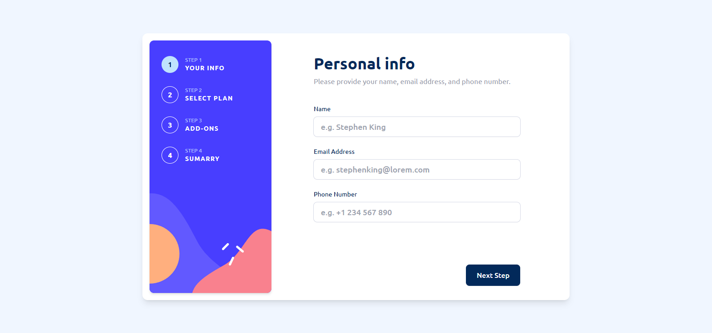

# Multi-step form



## Descrição

Este é o meu projeto para o desafio Multi-step Form do Frontend Mentor. O formulário multi-etapas foi implementado utilizando React, TypeScript, TailwindCSS, React Hook Form, Zod, Zustand e Radix UI.

[Link do Desafio](https://www.frontendmentor.io/challenges/multistep-form-YVAnSdqQBJ)

[Live](https://multi-step-form-xi-ruby.vercel.app)

## Funcionalidades

- **Formulário Multi-etapas**: Navegação entre várias etapas do formulário com estado persistente.

- **Validação de Dados**: Utilizando Zod e React Hook Form para garantir que os dados inseridos estejam corretos antes de passar para a próxima etapa.

- **Gerenciamento de Estado Global**: Zustand foi utilizado para manter o estado do formulário acessível em todas as etapas.

- **UI Responsiva e Acessível**: TailwindCSS e Radix UI garantem que o formulário seja visualmente agradável e acessível em diversos dispositivos.

## Como Executar

1. Certifique-se de ter o Node.js instalado.
2. Clone o repositório.
3. Instale as dependências usando o comando:
   ```
   npm install
   ```
4. Inicie o aplicativo com:
   ```
   npm run dev
   ```
5. Abra o aplicativo no seu navegador.

## Contribuições

Contribuições são bem-vindas! Sinta-se à vontade para abrir problemas ou enviar pull requests.